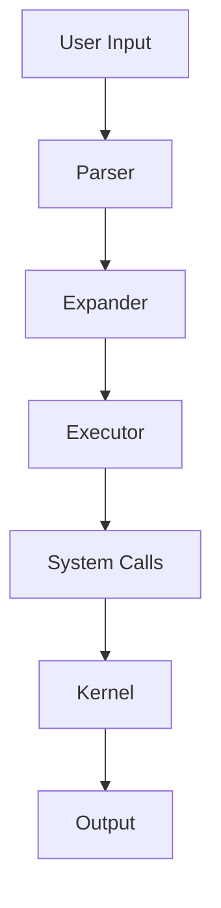
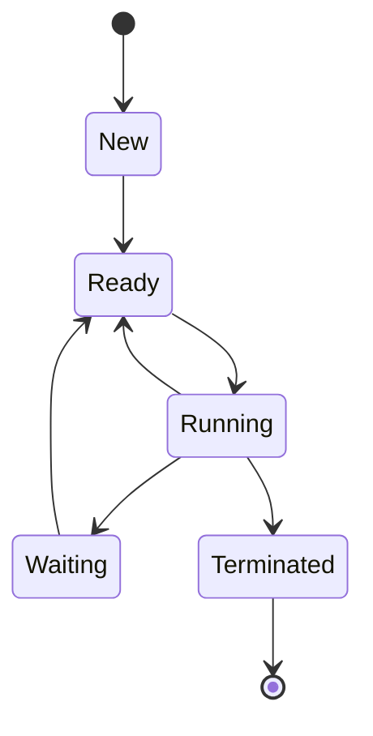

# Bash Scripting Guide: From Beginner to Advanced

## Table of Contents
- [Introduction](#introduction)
- [Getting Started](#getting-started)
- [Theoretical Concepts](#theoretical-concepts)
- [Basic Concepts](#basic-concepts)
- [Intermediate Concepts](#intermediate-concepts)
- [Advanced Concepts](#advanced-concepts)
- [Best Practices](#best-practices)
- [Practical Projects](#practical-projects)
- [Resources](#resources)

## Introduction

Bash (Bourne Again Shell) is a powerful command-line interpreter and scripting language for Unix-based systems. It's the default shell for most Linux distributions and macOS, making it an essential skill for system administrators, developers, and DevOps engineers.

### Why Learn Bash Scripting?
- **Automation**: Automate repetitive tasks
- **System Administration**: Manage servers and systems efficiently
- **DevOps**: Essential for CI/CD pipelines and deployment scripts
- **Productivity**: Streamline your workflow
- **Cross-Platform**: Works on Linux, macOS, and Windows (WSL)

## Getting Started

### Prerequisites
- A Unix-based operating system (Linux, macOS) or Windows with WSL
- Basic command-line knowledge
- A text editor (vim, nano, VS Code, etc.)

### Your First Script

Create a file called `hello.sh`:

```bash
#!/bin/bash
# This is a comment
echo "Hello, World!"
```

Make it executable and run it:
```bash
chmod +x hello.sh
./hello.sh
```

## Theoretical Concepts

### 1. Shell Architecture and Design

#### Shell Hierarchy and Evolution
```
sh (Bourne Shell, 1977)
├── ksh (Korn Shell, 1983)
├── csh (C Shell, 1978)
│   └── tcsh (TENEX C Shell, 1983)
└── bash (Bourne Again Shell, 1989)
    ├── zsh (Z Shell, 1990)
    └── dash (Debian Almquist Shell, 1997)
```

#### Shell Components
- **Parser**: Converts commands into executable tokens
- **Expander**: Handles variable, command, and pathname expansion
- **Executor**: Runs parsed commands
- **Job Controller**: Manages background and foreground processes

#### Process Model


### 2. Command Execution Theory

#### Command Parsing Pipeline
1. **Lexical Analysis**: Breaking input into tokens
2. **Syntactic Analysis**: Understanding command structure
3. **Semantic Analysis**: Validating command meaning
4. **Execution**: Running the command

#### Execution Context
- **Environment Variables**: Inherited from parent process
- **Shell Variables**: Local to current shell
- **Positional Parameters**: Command-line arguments
- **Exit Status**: Process termination status

#### Fork-Exec-Wait Pattern
```bash
# Theoretical model of command execution
parent_shell() {
    child_pid=$(fork)  # Create child process
    if [ $child_pid -eq 0 ]; then
        exec(command)  # Replace child with new command
    else
        wait(child_pid)  # Parent waits for completion
    fi
}
```

### 3. File System Theory

#### Unix File System Hierarchy
```
/               # Root directory
├── bin/         # Essential binaries
├── sbin/        # System binaries
├── etc/         # Configuration files
├── var/         # Variable data
├── home/        # User directories
├── usr/         # User programs
├── tmp/         # Temporary files
├── dev/         # Device files
├── proc/        # Process information
└── sys/         # System information
```

#### File Descriptors and I/O Redirection
- **Standard Input (0)**: Default input stream
- **Standard Output (1)**: Default output stream
- **Standard Error (2)**: Default error stream

#### File Permissions Model
```
Permission Bits: rwx rwx rwx
                 |   |   |
                 |   |   └── Others
                 |   └────── Group
                 └────────── Owner

Numeric: 421 421 421
         rwx rwx rwx
```

### 4. Process Management Theory

#### Process States


#### Process Hierarchy
- **Init Process (PID 1)**: Ancestor of all processes
- **Parent Process**: Creates child processes
- **Child Process**: Inherits from parent
- **Orphan Process**: Parent terminated before child
- **Zombie Process**: Completed but not reaped

#### Signal Theory
```bash
# Standard Signals
SIGHUP   1   # Hang up
SIGINT   2   # Interrupt (Ctrl+C)
SIGQUIT  3   # Quit (Ctrl+\)
SIGKILL  9   # Kill (cannot be caught)
SIGTERM 15   # Termination
SIGCHLD 20   # Child process status change
```

### 5. Text Processing Theory

#### Regular Expression Foundations
- **Literal Characters**: Match exact characters
- **Metacharacters**: Special meaning characters (. * + ? [] ^ $ \)
- **Character Classes**: Sets of characters [a-z], [0-9]
- **Quantifiers**: Repetition operators *, +, ?, {n,m}
- **Anchors**: Position markers ^, $

#### Stream Processing Model
```
Input Stream → Processing Pipeline → Output Stream
     ↓              ↓                    ↓
   File/Stdin    Filters/Commands    File/Stdout
```

#### Text Processing Tools Philosophy
- **grep**: Pattern matching and filtering
- **sed**: Stream editing (pattern-action pairs)
- **awk**: Pattern scanning and processing language
- **cut**: Column-based extraction
- **sort**: Line ordering and manipulation

### 6. Shell Programming Paradigms

#### Imperative Programming
- Sequential execution model
- Mutable state management
- Control flow structures
- Side effects and I/O operations

#### Functional Aspects
- Pipeline composition
- Function composition
- Immutable data streams
- Higher-order functions (map, filter, reduce)

#### Object-Oriented Concepts
- Encapsulation (functions and data)
- Inheritance (source command)
- Polymorphism (command substitution)
- Abstraction (complexity hiding)

### 7. Scripting Language Theory

#### Interpreted vs Compiled
```bash
# Interpreted execution
source script.sh    # Source in current shell
./script.sh         # Fork and execute
bash script.sh      # Explicit interpreter
```

#### Dynamic Typing
- Type inference at runtime
- Automatic type conversion
- Weak typing system
- Duck typing principles

#### Memory Management
- Automatic garbage collection
- Reference counting
- Process memory isolation
- Resource cleanup on exit

### 8. Security Theory

#### Principle of Least Privilege
- Minimal necessary permissions
- Role-based access control
- Separation of duties
- Audit trail maintenance

#### Input Validation Theory
- **Whitelist Approach**: Allow only known good inputs
- **Blacklist Approach**: Block known bad inputs
- **Sanitization**: Remove/replace dangerous characters
- **Canonicalization**: Convert to standard form

#### Injection Prevention
```bash
# Dangerous (vulnerable)
eval "rm -rf $user_input"

# Safe (parameterized)
rm -rf -- "$user_input"
```

### 9. Performance Theory

#### Time Complexity Analysis
- **O(1)**: Constant time operations
- **O(n)**: Linear time operations
- **O(n²)**: Quadratic time operations
- **O(log n)**: Logarithmic time operations

#### Space Complexity
- **In-place operations**: O(1) additional space
- **Buffer allocation**: O(n) additional space
- **Memory leaks**: Unreleased resources

#### Optimization Strategies
- **Algorithm selection**: Choose efficient algorithms
- **Caching**: Store computed results
- **Parallelization**: Concurrent execution
- **Resource pooling**: Reuse expensive resources

### 10. System Integration Theory

#### Inter-Process Communication
- **Pipes**: Anonymous communication channels
- **Files**: Persistent shared storage
- **Signals**: Asynchronous notifications
- **Sockets**: Network communication

#### Environment Variables
- **Inheritance**: Parent to child propagation
- **Scope**: Process lifetime
- **Namespace**: Name collision avoidance
- **Configuration**: External parameterization

#### Job Control Theory
- **Foreground Processes**: Controlling terminal access
- **Background Processes**: No terminal access
- **Process Groups**: Related process management
- **Sessions**: Terminal-bound process groups

### 11. Script Design Patterns

#### Template Method Pattern
```bash
# Abstract algorithm structure
process_file() {
    validate_input "$1"
    transform_data "$1"
    generate_output "$1"
    cleanup_resources
}
```

#### Strategy Pattern
```bash
# Configurable algorithms
case "$compression_type" in
    gzip) use_gzip ;;
    bzip2) use_bzip2 ;;
    xz) use_xz ;;
esac
```

#### Observer Pattern
```bash
# Event-driven architecture
notify_observers() {
    for observer in "${observers[@]}"; do
        $observer "$event_data"
    done
}
```

### 12. Testing Theory

#### Test Pyramid
```
    E2E Tests (Few)
   ─────────────────
  Integration Tests (Some)
 ─────────────────────────
Unit Tests (Many)
```

#### Test-Driven Development
1. **Red**: Write failing test
2. **Green**: Make test pass
3. **Refactor**: Improve code quality

#### Mocking and Stubbing
- **Stubs**: Pre-programmed responses
- **Mocks**: Behavior verification
- **Fakes**: Working implementations
- **Spies**: Call recording

### 13. DevOps Integration Theory

#### Infrastructure as Code
- **Declarative**: Describe desired state
- **Idempotent**: Same result on re-execution
- **Versioned**: Change tracking
- **Testable**: Validation possible

#### Continuous Integration Pipeline
```
Code Commit → Build → Test → Deploy → Monitor
     ↓         ↓      ↓       ↓       ↓
   Git     Compile  Unit    Prod   Metrics
           Link    Tests   Deploy  Alerts
```

#### Configuration Management
- **Environment-specific**: Dev/Staging/Prod
- **Secrets management**: Secure credential storage
- **Rollback strategies**: Failure recovery
- **Blue-green deployment**: Zero-downtime updates

### 14. Advanced Computational Theory

#### Automata Theory
- **Finite State Machines**: Pattern matching
- **Regular Expressions**: Pattern description
- **Context-Free Grammars**: Command parsing
- **Turing Completeness: Computational universality

#### Concurrency Theory
- **Race Conditions**: Shared data access
- **Deadlocks**: Circular waiting
- **Starvation**: Resource deprivation
- **Synchronization**: Coordination mechanisms

#### Distributed Systems
- **CAP Theorem**: Consistency, Availability, Partition tolerance
- **Eventual Consistency**: Convergence over time
- **Fault Tolerance**: Graceful degradation
- **Scalability**: Performance under load

## Basic Concepts

### 1. Introduction to Shell Scripting

<details>
<summary>📖 <strong>What is Shell Scripting?</strong></summary>

Any series of terminal commands can be put into a script. The shell, which is an interpreter, reads the script and executes those commands. Shell Scripting is useful to automate tasks, performing complex execution, etc.

**BASH script** = **B**ourne **A**gain **SH**ell script

</details>

<details>
<summary>🚀 <strong>Executing a Shell Script</strong></summary>

Give execute permission to your script:
```bash
chmod +x /path/to/yourscript.sh
```

Run your script:
```bash
/path/to/yourscript.sh
# Or using relative path (./ is necessary if directory is not in $PATH!)
./yourscript.sh
```

</details>

<details>
<summary>🔧 <strong>Shebang Line</strong></summary>

Every script STARTS with a shebang line:
```bash
#!/path/to/interpreter
```

The `#` (sharp) and `!` (bang/exclamation) are collectively known as the **'SHEBANG'**. This line tells us which interpreter (Shell) is supposed to execute this script!

**Examples:**
- `#!/bin/csh` = c shell
- `#!/bin/ksh` = k shell
- `#!/bin/zsh` = z shell
- `#!/bin/bash` = bash shell

**Note:** You don't have to use a shell as an interpreter. Example: `#!/usr/bin/python` uses the python interpreter (hence, a python script).

⚠️ **Warning:** If you don't specify the interpreter, the current shell executes the script but this is tricky. If the script contains commands not understood by the current shell, it could cause errors (Don't do this!).

</details>

### 2. Printing and Comments

<details>
<summary>📤 <strong>Displaying Output</strong></summary>

The `echo` command prints the supplied argument/string. Every echo statement prints on a NEW LINE.

```bash
echo "Hello World!"  # Output: Hello World!
```

</details>

<details>
<summary>💬 <strong>Comments</strong></summary>

Every line other than the first line (#!/bin/..) that STARTS with a `#` (pound/sharp/hash) marks a comment:

```bash
#!/bin/bash

# Let's print something    => A comment
echo "Hello There"

# End of printing          => A comment
```

**Rules:**
- If `#` STARTS on the line, the WHOLE LINE is IGNORED
- If `#` appears in the MIDDLE of a line, anything to the RIGHT of a `#` is IGNORED

</details>

### 3. Variables

<details>
<summary>📦 <strong>Variable Basics</strong></summary>

Variables are storage locations that have a name. They are 'name-value' pairs.

**Syntax:** `VARIABLE_NAME="Value"`

⚠️ **IMPORTANT:** NO SPACES before or after the `=`

**Variable Naming Rules:**
- Variable names are **CASE-SENSITIVE**
- By convention, they are usually in **UPPERCASE**
- Can contain: LETTERS (a-z, A-Z), DIGITS (0-9), and UNDERSCORES (_) ONLY
- **CANNOT START WITH A DIGIT**

</details>

<details>
<summary>🔤 <strong>Using Variables</strong></summary>

Precede the variable name with a `$` sign:

```bash
MY_SHELL="bash"
echo "This script uses the $MY_SHELL shell"
# Output: This script uses the bash shell
```

**Alternative (Recommended):** Enclose the variable in curly brackets `{}` and precede with a `$`:

```bash
MY_SHELL="bash"
echo "I am ${MY_SHELL}ing shell"
# Output: I am bashing on my keyboard
```

💡 **Best Practice:** Use the `${VARIABLE}` syntax if there is text or characters that directly precede or follow the variable.

If a specified variable does NOT exist, nothing is printed in its place in the echo statement.

</details>

<details>
<summary>⚡ <strong>Command Substitution</strong></summary>

Store command output in variables:

```bash
VAR_NAME=$(command)      # Modern syntax
VAR_NAME=`command`       # Older syntax (backticks)
```

**Example:**
```bash
CURRENT_DATE=$(date)
echo "Today is: $CURRENT_DATE"
```

</details>

### 4. Arrays

<details>
<summary>🗂️ <strong>Array Fundamentals</strong></summary>

Unlike variables, arrays can hold several values under one name.

**Initialization:**
```bash
my_array=("value 1" "value 2" "value 3" "value 4")
```

**Accessing Elements:**
```bash
# Access a single element (0-based indexing)
echo ${my_array[1]}        # Output: value 2

# Access the last element
echo ${my_array[-1]}       # Output: value 4

# Access all elements
echo ${my_array[@]}        # Output: value 1 value 2 value 3 value 4

# Get total number of elements
echo ${#my_array[@]}       # Output: 4
```

</details>

<details>
<summary>🔪 <strong>Array Slicing</strong></summary>

While Bash doesn't support true array slicing, you can achieve similar results:

```bash
#!/bin/bash
array=("A" "B" "C" "D" "E")

# Print entire array
echo "${array[@]}"          # Output: A B C D E

# Access a single element
echo "${array[1]}"          # Output: B

# Print a range of elements (requires Bash 4.0+)
echo "${array[@]:1:3}"      # Output: B C D

# Print from an index to the end
echo "${array[@]:3}"        # Output: D E
```

💡 **Tip:** Always use `[@]` to refer to all elements, and enclose the parameter expansion in quotes to preserve spaces in array elements.

</details>

<details>
<summary>✂️ <strong>String Slicing</strong></summary>

Extract portions of a string using slicing:

**Syntax:** `${string:start:length}`

Where:
- `start` is the starting index (0-based)
- `length` is the maximum number of characters to extract

```bash
#!/bin/bash
text="ABCDE"

# Extract from index 0, maximum 2 characters
echo "${text:0:2}"          # Output: AB

# Extract from index 3 to the end
echo "${text:3}"            # Output: DE

# Extract 3 characters starting from index 1
echo "${text:1:3}"          # Output: BCD

# If length exceeds remaining characters, it stops at the end
echo "${text:3:3}"          # Output: DE (only 2 characters available)
```

💡 **Note:** The second number represents the maximum length, not the ending index. If you specify a length that would extend beyond the end of the string, it will simply stop at the end without raising an error.

</details>
### 5. Tests and Conditions

<details>
<summary>🧪 <strong>Test Basics</strong></summary>

**Syntax:** `[ condition-to-test-for ]`

Returns true if test passes, else false.

**Example:** `[ -e /etc/passwd ]` tests if the '/etc/passwd' file exists.

**Practical Example:**
```bash
#!/bin/bash
# Check if required file exists before proceeding
CONFIG_FILE="/etc/myapp/config.json"

if [ -e "$CONFIG_FILE" ]; then
    echo "Configuration file found: $CONFIG_FILE"
    # Continue with application startup
else
    echo "ERROR: Configuration file missing: $CONFIG_FILE"
    exit 1
fi
```

</details>

<details>
<summary>📁 <strong>File Operator Tests</strong></summary>

**General Test Syntax:** `[ -flag fileOrDirPath ]`

| Flag | Description |
|------|-------------|
| `-d` | True if file is a directory |
| `-e` | True if file exists |
| `-f` | True if file exists and is a regular file |
| `-s` | True if file exists and is NOT empty |
| `-r` | True if file is readable by you |
| `-w` | True if file is writable by you |
| `-x` | True if file is executable by you |

**Comprehensive File Test Example:**
```bash
#!/bin/bash
# File validation script
FILE_PATH="$1"

if [ $# -eq 0 ]; then
    echo "Usage: $0 <file_path>"
    exit 1
fi

echo "Analyzing file: $FILE_PATH"
echo "=========================="

if [ -e "$FILE_PATH" ]; then
    echo "✅ File exists"
    
    if [ -f "$FILE_PATH" ]; then
        echo "📄 Regular file"
    elif [ -d "$FILE_PATH" ]; then
        echo "📁 Directory"
    fi
    
    if [ -s "$FILE_PATH" ]; then
        echo "📊 File is not empty"
        echo "📏 Size: $(wc -c < "$FILE_PATH") bytes"
    else
        echo "📭 File is empty"
    fi
    
    if [ -r "$FILE_PATH" ]; then
        echo "👁️ Readable"
    else
        echo "🚫 Not readable"
    fi
    
    if [ -w "$FILE_PATH" ]; then
        echo "✏️ Writable"
    else
        echo "🚫 Not writable"
    fi
    
    if [ -x "$FILE_PATH" ]; then
        echo "⚡ Executable"
    else
        echo "🚫 Not executable"
    fi
else
    echo "❌ File does not exist"
    exit 1
fi
```

**Directory Management Example:**
```bash
#!/bin/bash
# Backup directory creation and validation
BACKUP_DIR="/backup/$(date +%Y-%m-%d)"
SOURCE_DIR="/home/user/documents"

echo "Setting up backup directory: $BACKUP_DIR"

# Create directory if it doesn't exist
if [ ! -d "$BACKUP_DIR" ]; then
    mkdir -p "$BACKUP_DIR"
    echo "✅ Created backup directory"
else
    echo "ℹ️ Backup directory already exists"
fi

# Check if source directory exists and is readable
if [ -d "$SOURCE_DIR" ] && [ -r "$SOURCE_DIR" ]; then
    echo "✅ Source directory is accessible"
    # Proceed with backup
    cp -r "$SOURCE_DIR"/* "$BACKUP_DIR/"
    echo "📦 Backup completed"
else
    echo "❌ Source directory not accessible"
    exit 1
fi
```

</details>

<details>
<summary>🔤 <strong>String Operator Tests</strong></summary>

**General Test Syntax:** `[ -flag STRING ]`

| Flag | Description |
|------|-------------|
| `-z` | True if STRING is empty |
| `-n` | True if STRING is NOT empty |

**Equality Tests:**
- `STRING1 = STRING2` = True if strings are equal
- `STRING1 != STRING2` = True if strings are NOT equal

💡 **Important:** For testing variable strings in conditions, enclose them in quotes (`""`):
```bash
[ "$MY_SHELL" = "bash" ]
```

**String Validation Example:**
```bash
#!/bin/bash
# User input validation script
read -p "Enter your username: " username
read -p "Enter your email: " email
read -p "Enter your password: " -s password
echo

# Validate username
if [ -z "$username" ]; then
    echo "❌ Username cannot be empty"
    exit 1
elif [ ${#username} -lt 3 ]; then
    echo "❌ Username must be at least 3 characters"
    exit 1
else
    echo "✅ Username is valid"
fi

# Validate email
if [ -z "$email" ]; then
    echo "❌ Email cannot be empty"
    exit 1
elif [[ ! "$email" =~ ^[a-zA-Z0-9._%+-]+@[a-zA-Z0-9.-]+\.[a-zA-Z]{2,}$ ]]; then
    echo "❌ Invalid email format"
    exit 1
else
    echo "✅ Email is valid"
fi

# Validate password
if [ -z "$password" ]; then
    echo "❌ Password cannot be empty"
    exit 1
elif [ ${#password} -lt 8 ]; then
    echo "❌ Password must be at least 8 characters"
    exit 1
else
    echo "✅ Password is valid"
fi

echo "🎉 All validations passed!"
```

**Configuration File Parser Example:**
```bash
#!/bin/bash
# Simple configuration file parser
CONFIG_FILE="app.conf"

if [ ! -f "$CONFIG_FILE" ]; then
    echo "❌ Configuration file not found: $CONFIG_FILE"
    exit 1
fi

while IFS='=' read -r key value; do
    # Skip empty lines and comments
    if [ -n "$key" ] && [[ ! "$key" =~ ^# ]]; then
        # Remove leading/trailing whitespace
        key=$(echo "$key" | xargs)
        value=$(echo "$value" | xargs)
        
        case "$key" in
            "app_name")
                if [ -n "$value" ]; then
                    APP_NAME="$value"
                    echo "✅ App name set: $APP_NAME"
                else
                    echo "⚠️ App name is empty"
                fi
                ;;
            "debug_mode")
                if [ "$value" = "true" ] || [ "$value" = "false" ]; then
                    DEBUG_MODE="$value"
                    echo "✅ Debug mode set: $DEBUG_MODE"
                else
                    echo "❌ Invalid debug mode: $value"
                fi
                ;;
            "port")
                if [[ "$value" =~ ^[0-9]+$ ]] && [ "$value" -gt 0 ] && [ "$value" -le 65535 ]; then
                    PORT="$value"
                    echo "✅ Port set: $PORT"
                else
                    echo "❌ Invalid port number: $value"
                fi
                ;;
        esac
    fi
done < "$CONFIG_FILE"
```

</details>

<details>
<summary>🔢 <strong>Arithmetic Operator Tests</strong></summary>

**General Test Syntax:** `[ arg1 -flag arg2 ]`

| Flag | Description |
|------|-------------|
| `-eq` | True if arg1 equals arg2 |
| `-ne` | True if arg1 is NOT equal to arg2 |
| `-lt` | True if arg1 is LESS THAN arg2 |
| `-le` | True if arg1 is LESS THAN OR EQUAL TO arg2 |
| `-gt` | True if arg1 is GREATER THAN arg2 |
| `-ge` | True if arg1 is GREATER THAN OR EQUAL TO arg2 |

💡 **Help:** Run `man test` for more information on tests.

**System Resource Monitor Example:**
```bash
#!/bin/bash
# System resource monitoring with alerts

# Get current memory usage percentage
MEMORY_USAGE=$(free | grep Mem | awk '{printf("%.1f", $3/$2 * 100.0)}')
DISK_USAGE=$(df / | tail -1 | awk '{print $5}' | sed 's/%//')
CPU_LOAD=$(uptime | awk -F'load average:' '{print $2}' | awk '{print $1}' | sed 's/,//')

echo "System Resource Status"
echo "====================="
echo "Memory Usage: ${MEMORY_USAGE}%"
echo "Disk Usage: ${DISK_USAGE}%"
echo "CPU Load: $CPU_LOAD"

# Check memory usage
if (( $(echo "$MEMORY_USAGE > 80" | bc -l) )); then
    echo "⚠️ WARNING: High memory usage (${MEMORY_USAGE}%)"
elif (( $(echo "$MEMORY_USAGE > 90" | bc -l) )); then
    echo "🚨 CRITICAL: Very high memory usage (${MEMORY_USAGE}%)"
else
    echo "✅ Memory usage is normal"
fi

# Check disk usage
if [ "$DISK_USAGE" -gt 80 ]; then
    echo "⚠️ WARNING: High disk usage (${DISK_USAGE}%)"
elif [ "$DISK_USAGE" -gt 90 ]; then
    echo "🚨 CRITICAL: Very high disk usage (${DISK_USAGE}%)"
else
    echo "✅ Disk usage is normal"
fi

# Check CPU load
if (( $(echo "$CPU_LOAD > 2.0" | bc -l) )); then
    echo "⚠️ WARNING: High CPU load ($CPU_LOAD)"
elif (( $(echo "$CPU_LOAD > 4.0" | bc -l) )); then
    echo "🚨 CRITICAL: Very high CPU load ($CPU_LOAD)"
else
    echo "✅ CPU load is normal"
fi
```

**Age Calculator Example:**
```bash
#!/bin/bash
# Age calculator and category classifier
read -p "Enter your age: " age

# Validate input is a number
if ! [[ "$age" =~ ^[0-9]+$ ]]; then
    echo "❌ Please enter a valid number"
    exit 1
fi

echo "Age: $age years"

# Categorize age
if [ "$age" -lt 0 ]; then
    echo "❌ Invalid age (negative)"
elif [ "$age" -le 12 ]; then
    echo "👶 Category: Child"
elif [ "$age" -le 19 ]; then
    echo "🧑 Category: Teenager"
elif [ "$age" -le 35 ]; then
    echo "👨 Category: Young Adult"
elif [ "$age" -le 60 ]; then
    echo "👴 Category: Adult"
elif [ "$age" -le 100 ]; then
    echo "👵 Category: Senior"
else
    echo "🎂 Category: Centenarian+"
fi

# Check eligibility for various activities
if [ "$age" -ge 18 ]; then
    echo "✅ Eligible to vote"
else
    echo "❌ Not eligible to vote"
fi

if [ "$age" -ge 21 ]; then
    echo "✅ Eligible to drive (in most countries)"
else
    echo "❌ Not eligible to drive"
fi

if [ "$age" -ge 65 ]; then
    echo "✅ Eligible for senior benefits"
else
    echo "ℹ️ Not eligible for senior benefits"
fi
```

**File Size Comparison Example:**
```bash
#!/bin/bash
# Compare file sizes
FILE1="$1"
FILE2="$2"

if [ $# -ne 2 ]; then
    echo "Usage: $0 <file1> <file2>"
    exit 1
fi

if [ ! -f "$FILE1" ] || [ ! -f "$FILE2" ]; then
    echo "❌ Both files must exist"
    exit 1
fi

SIZE1=$(stat -c%s "$FILE1")
SIZE2=$(stat -c%s "$FILE2")

echo "File comparison:"
echo "================"
echo "$FILE1: $SIZE1 bytes"
echo "$FILE2: $SIZE2 bytes"

if [ "$SIZE1" -eq "$SIZE2" ]; then
    echo "📏 Files are the same size"
elif [ "$SIZE1" -gt "$SIZE2" ]; then
    DIFF=$((SIZE1 - SIZE2))
    echo "📈 $FILE1 is larger by $DIFF bytes"
else
    DIFF=$((SIZE2 - SIZE1))
    echo "📉 $FILE2 is larger by $DIFF bytes"
fi

# Size categories
for file in "$FILE1" "$FILE2"; do
    size=$(stat -c%s "$file")
    
    if [ "$size" -lt 1024 ]; then
        echo "📄 $file: Small (< 1KB)"
    elif [ "$size" -lt 1048576 ]; then
        echo "📃 $file: Medium (< 1MB)"
    elif [ "$size" -lt 1073741824 ]; then
        echo "📋 $file: Large (< 1GB)"
    else
        echo "📚 $file: Very Large (≥ 1GB)"
    fi
done
```

</details>

### 6. Conditional Statements

<details>
<summary>🔀 <strong>if Statement</strong></summary>

```bash
if [ condition-is-true ]
then
    command 1
    command 2
    ...
    command N
fi
```

**Practical Example:**
```bash
#!/bin/bash
# Simple backup verification script
BACKUP_FILE="/backup/data_$(date +%Y%m%d).tar.gz"

if [ -f "$BACKUP_FILE" ]; then
    echo "✅ Backup file exists: $BACKUP_FILE"
    echo "📏 Size: $(du -h "$BACKUP_FILE" | cut -f1)"
    echo "📅 Created: $(stat -c %y "$BACKUP_FILE")"
    
    # Verify backup integrity
    if tar -tzf "$BACKUP_FILE" >/dev/null 2>&1; then
        echo "✅ Backup integrity verified"
    else
        echo "❌ Backup integrity check failed"
        exit 1
    fi
else
    echo "❌ Backup file not found: $BACKUP_FILE"
    echo "🔄 Starting backup process..."
    # Create backup logic here
fi
```

</details>

<details>
<summary>🔀 <strong>if-else Statement</strong></summary>

```bash
if [ condition-is-true ]
then
    commands 1 ... N
else
    commands 1 ... N
fi
```

**User Authentication Example:**
```bash
#!/bin/bash
# Simple user authentication simulation
CORRECT_USERNAME="admin"
CORRECT_PASSWORD="secure123"

read -p "Username: " username
read -s -p "Password: " password
echo

if [ "$username" = "$CORRECT_USERNAME" ] && [ "$password" = "$CORRECT_PASSWORD" ]; then
    echo "✅ Authentication successful!"
    echo "🎯 Welcome, $username!"
    echo "📊 System access granted"
    # Continue with privileged operations
else
    echo "❌ Authentication failed!"
    echo "🚫 Invalid username or password"
    echo "⚠️ Access denied"
    exit 1
fi
```

**Service Status Checker Example:**
```bash
#!/bin/bash
# Check if critical services are running
SERVICE="nginx"

if systemctl is-active --quiet "$SERVICE"; then
    echo "✅ $SERVICE is running"
    echo "📊 Status: $(systemctl is-active "$SERVICE")"
    echo "⏰ Uptime: $(systemctl show "$SERVICE" --property=ActiveEnterTimestamp | cut -d= -f2)"
else
    echo "❌ $SERVICE is not running"
    echo "🔄 Attempting to start $SERVICE..."
    
    if sudo systemctl start "$SERVICE"; then
        echo "✅ $SERVICE started successfully"
    else
        echo "❌ Failed to start $SERVICE"
        echo "📧 Sending alert notification..."
        # Alert logic here
        exit 1
    fi
fi
```

</details>

<details>
<summary>🔀 <strong>if-elif-else Statement</strong></summary>

```bash
if [ condition-is-true ]
then
    commands 1 ... N
elif [ condition-is-true ]
then
    commands 1 ... N
else
    commands 1 ... N
fi
```

**File Type Handler Example:**
```bash
#!/bin/bash
# File type processor based on extension
FILE="$1"

if [ $# -eq 0 ]; then
    echo "Usage: $0 <filename>"
    exit 1
fi

if [ ! -f "$FILE" ]; then
    echo "❌ File not found: $FILE"
    exit 1
fi

EXTENSION="${FILE##*.}"

echo "Processing file: $FILE"
echo "Extension: $EXTENSION"

if [ "$EXTENSION" = "jpg" ] || [ "$EXTENSION" = "jpeg" ]; then
    echo "🖼️ Processing JPEG image..."
    convert "$FILE" "${FILE%.*}_processed.jpg"
    echo "✅ Image processed successfully"
elif [ "$EXTENSION" = "png" ]; then
    echo "🖼️ Processing PNG image..."
    convert "$FILE" "${FILE%.*}_processed.png"
    echo "✅ Image processed successfully"
elif [ "$EXTENSION" = "pdf" ]; then
    echo "📄 Processing PDF document..."
    pdftotext "$FILE" "${FILE%.*}.txt"
    echo "✅ PDF converted to text"
elif [ "$EXTENSION" = "txt" ]; then
    echo "📝 Processing text file..."
    wc -l "$FILE"
    echo "✅ Text file analyzed"
elif [ "$EXTENSION" = "log" ]; then
    echo "📊 Processing log file..."
    echo "🔍 Top 5 errors:"
    grep -i error "$FILE" | head -5
    echo "✅ Log file analyzed"
else
    echo "❓ Unknown file type: $EXTENSION"
    echo "📋 Supported formats: jpg, jpeg, png, pdf, txt, log"
fi
```

**System Load Manager Example:**
```bash
#!/bin/bash
# System load-based action manager
LOAD_1MIN=$(uptime | awk -F'load average:' '{print $2}' | awk '{print $1}' | sed 's/,//')
LOAD_5MIN=$(uptime | awk -F'load average:' '{print $2}' | awk '{print $2}' | sed 's/,//')
LOAD_15MIN=$(uptime | awk -F'load average:' '{print $2}' | awk '{print $3}')

echo "System Load Analysis"
echo "==================="
echo "1 min:  $LOAD_1MIN"
echo "5 min:  $LOAD_5MIN"
echo "15 min: $LOAD_15MIN"

if (( $(echo "$LOAD_1MIN > 5.0" | bc -l) )); then
    echo "🚨 CRITICAL: Very high system load!"
    echo "🔄 Emergency actions:"
    echo "  - Stopping non-essential services"
    echo "  - Clearing temporary files"
    echo "  - Sending critical alert"
    # Emergency procedures
elif (( $(echo "$LOAD_1MIN > 2.0" | bc -l) )); then
    echo "⚠️ WARNING: High system load"
    echo "🔧 Preventive actions:"
    echo "  - Monitoring resource usage"
    echo "  - Checking for runaway processes"
    # Preventive measures
elif (( $(echo "$LOAD_1MIN > 1.0" | bc -l) )); then
    echo "ℹ️ NOTICE: Moderate system load"
    echo "📊 Normal monitoring continues"
else
    echo "✅ GOOD: System load is normal"
    echo "🎯 All systems operational"
fi
```

**Grade Calculator Example:**
```bash
#!/bin/bash
# Student grade calculator
read -p "Enter student score (0-100): " score

# Validate input
if ! [[ "$score" =~ ^[0-9]+$ ]] || [ "$score" -lt 0 ] || [ "$score" -gt 100 ]; then
    echo "❌ Invalid score. Please enter a number between 0 and 100."
    exit 1
fi

echo "Score: $score/100"

if [ "$score" -ge 90 ]; then
    grade="A"
    remark="Excellent! Outstanding performance!"
elif [ "$score" -ge 80 ]; then
    grade="B"
    remark="Very Good! Above average performance!"
elif [ "$score" -ge 70 ]; then
    grade="C"
    remark="Good! Satisfactory performance!"
elif [ "$score" -ge 60 ]; then
    grade="D"
    remark="Fair! Needs improvement!"
else
    grade="F"
    remark="Poor! Significant improvement needed!"
fi

echo "Grade: $grade"
echo "Remark: $remark"

# Additional recommendations
if [ "$score" -lt 60 ]; then
    echo "💡 Recommendations:"
    echo "  - Attend tutoring sessions"
    echo "  - Complete additional practice exercises"
    echo "  - Schedule meeting with instructor"
elif [ "$score" -ge 90 ]; then
    echo "🏆 Achievements:"
    echo "  - Eligible for honors program"
    echo "  - Consider advanced coursework"
fi
```

</details>

### 7. Loops

<details>
<summary>🔄 <strong>for Loop</strong></summary>

```bash
for VARIABLE_NAME in ITEM_1 ... ITEM_N
do
    command 1
    command 2
    ...
    command N
done
```

**Example 1:**
```bash
for COLOR in red green blue
do
    echo "COLOR: $COLOR"
done
# Output:
# COLOR: red
# COLOR: green
# COLOR: blue
```

**Example 2:**
```bash
COLORS="red green blue"
for COLOR in $COLORS
do
    echo "COLOR: $COLOR"
done
```

💡 **Note:** The variable name need NOT be declared earlier.

**File Processing Example:**
```bash
#!/bin/bash
# Batch file processor
TARGET_DIR="/home/user/documents"
PROCESSED_DIR="/home/user/processed"

# Create processed directory if it doesn't exist
mkdir -p "$PROCESSED_DIR"

echo "Processing files in: $TARGET_DIR"
echo "================================="

# Process all .txt files
for file in "$TARGET_DIR"/*.txt; do
    if [ -f "$file" ]; then
        filename=$(basename "$file")
        echo "📄 Processing: $filename"
        
        # Count lines, words, and characters
        lines=$(wc -l < "$file")
        words=$(wc -w < "$file")
        chars=$(wc -c < "$file")
        
        echo "  📊 Lines: $lines, Words: $words, Characters: $chars"
        
        # Create summary file
        summary_file="$PROCESSED_DIR/${filename%.txt}_summary.txt"
        echo "File: $filename" > "$summary_file"
        echo "Lines: $lines" >> "$summary_file"
        echo "Words: $words" >> "$summary_file"
        echo "Characters: $chars" >> "$summary_file"
        echo "Processed: $(date)" >> "$summary_file"
        
        echo "  ✅ Summary created: ${filename%.txt}_summary.txt"
    fi
done

echo "🎉 Processing completed!"
```

**System Information Collector Example:**
```bash
#!/bin/bash
# System information collector
INFO_FILE="system_info_$(date +%Y%m%d_%H%M%S).txt"

echo "System Information Report" > "$INFO_FILE"
echo "=========================" >> "$INFO_FILE"
echo "Generated: $(date)" >> "$INFO_FILE"
echo "" >> "$INFO_FILE"

# Collect various system information
for info_type in "hostname" "kernel" "uptime" "memory" "disk" "cpu"; do
    case "$info_type" in
        "hostname")
            echo "Hostname: $(hostname)" >> "$INFO_FILE"
            ;;
        "kernel")
            echo "Kernel: $(uname -r)" >> "$INFO_FILE"
            ;;
        "uptime")
            echo "Uptime: $(uptime -p)" >> "$INFO_FILE"
            ;;
        "memory")
            echo "Memory Usage:" >> "$INFO_FILE"
            free -h >> "$INFO_FILE"
            ;;
        "disk")
            echo "Disk Usage:" >> "$INFO_FILE"
            df -h >> "$INFO_FILE"
            ;;
        "cpu")
            echo "CPU Info:" >> "$INFO_FILE"
            lscpu | grep "Model name" >> "$INFO_FILE"
            ;;
    esac
    echo "" >> "$INFO_FILE"
done

echo "✅ System information saved to: $INFO_FILE"
echo "📊 Report contains $(wc -l < "$INFO_FILE") lines"
```

**User Account Manager Example:**
```bash
#!/bin/bash
# User account management utility
USERS=("alice" "bob" "charlie" "diana")

echo "User Account Management"
echo "====================="

for user in "${USERS[@]}"; do
    echo "👤 Checking user: $user"
    
    if id "$user" &>/dev/null; then
        echo "  ✅ User exists"
        
        # Get user information
        user_info=$(getent passwd "$user")
        home_dir=$(echo "$user_info" | cut -d: -f6)
        shell=$(echo "$user_info" | cut -d: -f7)
        
        echo "  🏠 Home directory: $home_dir"
        echo "  🐚 Shell: $shell"
        
        # Check if user is logged in
        if who | grep -q "^$user "; then
            echo "  🟢 Currently logged in"
        else
            echo "  🔴 Not logged in"
        fi
        
        # Check home directory size
        if [ -d "$home_dir" ]; then
            size=$(du -sh "$home_dir" 2>/dev/null | cut -f1)
            echo "  📁 Home directory size: $size"
        fi
    else
        echo "  ❌ User does not exist"
        echo "  💡 Creating user account..."
        
        if sudo useradd -m -s /bin/bash "$user"; then
            echo "  ✅ User created successfully"
        else
            echo "  ❌ Failed to create user"
        fi
    fi
    echo ""
done
```

**Number Pattern Generator Example:**
```bash
#!/bin/bash
# Number pattern generator
read -p "Enter pattern size (1-10): " size

# Validate input
if ! [[ "$size" =~ ^[0-9]+$ ]] || [ "$size" -lt 1 ] || [ "$size" -gt 10 ]; then
    echo "❌ Please enter a number between 1 and 10"
    exit 1
fi

echo "Pattern Size: $size"
echo "=================="

# Right triangle pattern
echo "📐 Right Triangle:"
for ((i=1; i<=size; i++)); do
    for ((j=1; j<=i; j++)); do
        echo -n "$j "
    done
    echo
done

echo ""

# Inverted triangle
echo "📐 Inverted Triangle:"
for ((i=size; i>=1; i--)); do
    for ((j=1; j<=i; j++)); do
        echo -n "$j "
    done
    echo
done

echo ""

# Pyramid pattern
echo "🔺 Pyramid:"
for ((i=1; i<=size; i++)); do
    # Print spaces
    for ((j=1; j<=size-i; j++)); do
        echo -n "  "
    done
    
    # Print numbers
    for ((j=1; j<=2*i-1; j++)); do
        echo -n "$i "
    done
    echo
done
```

</details>

<details>
<summary>🔄 <strong>while Loop</strong></summary>

```bash
while [ CONDITION_IS_TRUE ]
do
    command 1
    command 2
    ...
    command N
done
```

**Example 1:**
```bash
INDEX=1
while [ $INDEX -lt 6 ]
do
    echo "Creating project-${INDEX}"
    mkdir /usr/local/project-${INDEX}
    ((INDEX++))  # Arithmetic operations are enclosed within '((...))'
done
```

**Example 2:**
```bash
while [ "$CORRECT" != "y" ]
do
    read -p "Enter your name: " NAME
    read -p "Is $NAME correct?: " CORRECT
done
```

**Example 3:**
```bash
while ping -c 1 app1 > /dev/null  # ping must succeed & redirect output to /dev/null
do
    echo "app1 still up ... "
    sleep 5  # Pause execution for 5 seconds
done
echo "app1 is down! ... "
```

**Interactive Menu Example:**
```bash
#!/bin/bash
# Interactive menu system
while true; do
    echo "================================"
    echo "        SYSTEM MENU"
    echo "================================"
    echo "1. Check System Status"
    echo "2. View Disk Usage"
    echo "3. Monitor Memory"
    echo "4. List Running Processes"
    echo "5. Check Network Status"
    echo "6. Exit"
    echo "================================"
    
    read -p "Enter your choice (1-6): " choice
    
    case $choice in
        1)
            echo "🔍 System Status:"
            echo "Kernel: $(uname -r)"
            echo "Uptime: $(uptime -p)"
            echo "Load: $(uptime | awk -F'load average:' '{print $2}')"
            ;;
        2)
            echo "💾 Disk Usage:"
            df -h
            ;;
        3)
            echo "🧠 Memory Usage:"
            free -h
            ;;
        4)
            echo "⚡ Running Processes:"
            ps aux --sort=-%cpu | head -10
            ;;
        5)
            echo "🌐 Network Status:"
            ip addr show | grep -E "inet|UP"
            ;;
        6)
            echo "👋 Goodbye!"
            exit 0
            ;;
        *)
            echo "❌ Invalid choice. Please try again."
            ;;
    esac
    
    echo ""
    read -p "Press Enter to continue..."
    clear
done
```

**Progress Bar Example:**
```bash
#!/bin/bash
# Animated progress bar
TOTAL=50
CURRENT=0

echo "Processing files..."
echo "=================="

while [ $CURRENT -le $TOTAL ]; do
    # Calculate percentage
    PERCENT=$((CURRENT * 100 / TOTAL))
    
    # Create progress bar
    BAR_LENGTH=30
    FILLED_LENGTH=$((PERCENT * BAR_LENGTH / 100))
    
    bar=""
    for ((i=0; i<FILLED_LENGTH; i++)); do
        bar+="█"
    done
    for ((i=FILLED_LENGTH; i<BAR_LENGTH; i++)); do
        bar+="░"
    done
    
    # Display progress
    printf "\r[%s] %d%% (%d/%d)" "$bar" "$PERCENT" "$CURRENT" "$TOTAL"
    
    # Simulate work
    sleep 0.1
    ((CURRENT++))
done

echo ""
echo "✅ Processing completed!"
```

**Password Generator Example:**
```bash
#!/bin/bash
# Password generator with validation
CHARS="abcdefghijklmnopqrstuvwxyzABCDEFGHIJKLMNOPQRSTUVWXYZ0123456789!@#$%^&*"

while true; do
    read -p "Enter password length (8-32): " length
    
    # Validate input
    if ! [[ "$length" =~ ^[0-9]+$ ]] || [ "$length" -lt 8 ] || [ "$length" -gt 32 ]; then
        echo "❌ Please enter a number between 8 and 32"
        continue
    fi
    
    # Generate password
    password=""
    for ((i=0; i<length; i++)); do
        random_index=$((RANDOM % ${#CHARS}))
        password+="${CHARS:$random_index:1}"
    done
    
    echo "🔑 Generated Password: $password"
    
    # Validate password strength
    has_upper=false
    has_lower=false
    has_digit=false
    has_special=false
    
    if [[ "$password" =~ [A-Z] ]]; then
        has_upper=true
    fi
    
    if [[ "$password" =~ [a-z] ]]; then
        has_lower=true
    fi
    
    if [[ "$password" =~ [0-9] ]]; then
        has_digit=true
    fi
    
    if [[ "$password" =~ [!@#$%^&*] ]]; then
        has_special=true
    fi
    
    echo "📊 Password Strength Analysis:"
    echo "  🔤 Uppercase letters: $([ "$has_upper" = true ] && echo "✅" || echo "❌")"
    echo "  🔡 Lowercase letters: $([ "$has_lower" = true ] && echo "✅" || echo "❌")"
    echo "  🔢 Numbers: $([ "$has_digit" = true ] && echo "✅" || echo "❌")"
    echo "  🔣 Special characters: $([ "$has_special" = true ] && echo "✅" || echo "❌")"
    
    if $has_upper && $has_lower && $has_digit && $has_special; then
        echo "🎉 Strong password!"
    else
        echo "⚠️ Consider improving password strength"
    fi
    
    read -p "Generate another password? (y/n): " again
    if [ "$again" != "y" ] && [ "$again" != "Y" ]; then
        break
    fi
done
```

**Server Health Monitor Example:**
```bash
#!/bin/bash
# Continuous server health monitoring
LOG_FILE="server_health_$(date +%Y%m%d).log"
ALERT_THRESHOLD_CPU=80
ALERT_THRESHOLD_MEMORY=90
ALERT_THRESHOLD_DISK=85

echo "Server Health Monitor Started" | tee -a "$LOG_FILE"
echo "=============================" | tee -a "$LOG_FILE"

while true; do
    timestamp=$(date '+%Y-%m-%d %H:%M:%S')
    
    # Get system metrics
    cpu_usage=$(top -bn1 | grep "Cpu(s)" | awk '{print $2}' | sed 's/%us,//')
    memory_usage=$(free | grep Mem | awk '{printf("%.1f", $3/$2 * 100.0)}')
    disk_usage=$(df / | tail -1 | awk '{print $5}' | sed 's/%//')
    
    # Log current status
    echo "[$timestamp] CPU: ${cpu_usage}%, Memory: ${memory_usage}%, Disk: ${disk_usage}%" | tee -a "$LOG_FILE"
    
    # Check for alerts
    alert_message=""
    
    if (( $(echo "$cpu_usage > $ALERT_THRESHOLD_CPU" | bc -l) )); then
        alert_message+="HIGH CPU USAGE: ${cpu_usage}% "
    fi
    
    if (( $(echo "$memory_usage > $ALERT_THRESHOLD_MEMORY" | bc -l) )); then
        alert_message+="HIGH MEMORY USAGE: ${memory_usage}% "
    fi
    
    if [ "$disk_usage" -gt "$ALERT_THRESHOLD_DISK" ]; then
        alert_message+="HIGH DISK USAGE: ${disk_usage}% "
    fi
    
    # Send alert if needed
    if [ -n "$alert_message" ]; then
        echo "🚨 ALERT: $alert_message" | tee -a "$LOG_FILE"
        # Here you could send email, SMS, or push notification
        # mail -s "Server Alert" admin@example.com <<< "Alert: $alert_message"
    fi
    
    # Wait before next check
    sleep 60
done
```

</details>

<details>
<summary>🔄 <strong>Infinite While Loops</strong></summary>

Condition is always true, keeps looping forever (Use `CTRL-C` to exit):

```bash
while true
do
    command 1 ... N
    sleep 1
done
```

💡 **Use Case:** Running daemon processes in the background.

**Clock Display Example:**
```bash
#!/bin/bash
# Digital clock display
while true; do
    clear
    echo "=================="
    echo "   DIGITAL CLOCK"
    echo "=================="
    date '+%H:%M:%S'
    date '+%A, %B %d, %Y'
    echo "=================="
    sleep 1
done
```

**File Watcher Example:**
```bash
#!/bin/bash
# Monitor directory for new files
WATCH_DIR="/home/user/downloads"
echo "Watching directory: $WATCH_DIR"
echo "Press Ctrl+C to stop watching..."

while true; do
    # Get current file count
    current_count=$(find "$WATCH_DIR" -type f | wc -l)
    
    if [ -z "$last_count" ]; then
        last_count=$current_count
    fi
    
    if [ "$current_count" -gt "$last_count" ]; then
        echo "🆕 New files detected!"
        find "$WATCH_DIR" -type f -mmin -1 -exec echo "  📄 {}" \;
        last_count=$current_count
    fi
    
    sleep 5
done
```

</details>

<details>
<summary>📖 <strong>Reading Files Line by Line</strong></summary>

```bash
LINE_NUM=1
while read LINE
do
    echo "${LINE_NUM}: ${LINE}"
    ((LINE_NUM++))
done < /etc/fstab
```

💡 **Note:** The `/etc/fstab` is taken as input to the whole while loop. The `read LINE` command reads the current line of the file.

**Log Analyzer Example:**
```bash
#!/bin/bash
# Log file analyzer
LOG_FILE="/var/log/syslog"
ERROR_COUNT=0
WARNING_COUNT=0
INFO_COUNT=0

if [ ! -f "$LOG_FILE" ]; then
    echo "❌ Log file not found: $LOG_FILE"
    exit 1
fi

echo "Analyzing log file: $LOG_FILE"
echo "============================="

while read -r line; do
    # Skip empty lines
    if [ -z "$line" ]; then
        continue
    fi
    
    # Count different log levels
    if echo "$line" | grep -qi "error"; then
        ((ERROR_COUNT++))
        echo "❌ ERROR: $line"
    elif echo "$line" | grep -qi "warning"; then
        ((WARNING_COUNT++))
        echo "⚠️ WARNING: $line"
    elif echo "$line" | grep -qi "info"; then
        ((INFO_COUNT++))
    fi
done < "$LOG_FILE"

echo ""
echo "📊 Log Analysis Summary:"
echo "  Errors: $ERROR_COUNT"
echo "  Warnings: $WARNING_COUNT"
echo "  Info messages: $INFO_COUNT"
echo "  Total lines processed: $((ERROR_COUNT + WARNING_COUNT + INFO_COUNT))"
```

**User Account Processor Example:**
```bash
#!/bin/bash
# Process user accounts from file
USER_FILE="users.txt"
OUTPUT_FILE="user_report_$(date +%Y%m%d).txt"

if [ ! -f "$USER_FILE" ]; then
    echo "❌ User file not found: $USER_FILE"
    exit 1
fi

echo "User Account Report" > "$OUTPUT_FILE"
echo "===================" >> "$OUTPUT_FILE"
echo "Generated: $(date)" >> "$OUTPUT_FILE"
echo "" >> "$OUTPUT_FILE"

while IFS=',' read -r username department email; do
    # Skip header line or empty lines
    if [ "$username" = "Username" ] || [ -z "$username" ]; then
        continue
    fi
    
    echo "Processing user: $username"
    
    # Check if user exists
    if id "$username" &>/dev/null; then
        status="✅ Exists"
        home_dir=$(getent passwd "$username" | cut -d: -f6)
        echo "User: $username" >> "$OUTPUT_FILE"
        echo "Department: $department" >> "$OUTPUT_FILE"
        echo "Email: $email" >> "$OUTPUT_FILE"
        echo "Status: $status" >> "$OUTPUT_FILE"
        echo "Home Directory: $home_dir" >> "$OUTPUT_FILE"
    else
        status="❌ Not Found"
        echo "User: $username" >> "$OUTPUT_FILE"
        echo "Department: $department" >> "$OUTPUT_FILE"
        echo "Email: $email" >> "$OUTPUT_FILE"
        echo "Status: $status" >> "$OUTPUT_FILE"
    fi
    
    echo "" >> "$OUTPUT_FILE"
done < "$USER_FILE"

echo "✅ User report generated: $OUTPUT_FILE"
```

**Configuration File Validator Example:**
```bash
#!/bin/bash
# Configuration file validator
CONFIG_FILE="app.conf"
VALID_CONFIG=true

if [ ! -f "$CONFIG_FILE" ]; then
    echo "❌ Configuration file not found: $CONFIG_FILE"
    exit 1
fi

echo "Validating configuration file: $CONFIG_FILE"
echo "=========================================="

line_num=0
while read -r line; do
    ((line_num++))
    
    # Skip empty lines and comments
    if [ -z "$line" ] || [[ "$line" =~ ^[[:space:]]*# ]]; then
        continue
    fi
    
    # Check for valid key=value format
    if [[ ! "$line" =~ ^[a-zA-Z_][a-zA-Z0-9_]*[[:space:]]*=[[:space:]]*.+$ ]]; then
        echo "❌ Line $line_num: Invalid format - $line"
        VALID_CONFIG=false
        continue
    fi
    
    # Extract key and value
    key=$(echo "$line" | cut -d'=' -f1 | xargs)
    value=$(echo "$line" | cut -d'=' -f2- | xargs)
    
    echo "✅ Line $line_num: $key = $value"
    
    # Validate specific configuration options
    case "$key" in
        "port")
            if ! [[ "$value" =~ ^[0-9]+$ ]] || [ "$value" -lt 1 ] || [ "$value" -gt 65535 ]; then
                echo "❌ Line $line_num: Invalid port number - $value"
                VALID_CONFIG=false
            fi
            ;;
        "debug_mode")
            if [ "$value" != "true" ] && [ "$value" != "false" ]; then
                echo "❌ Line $line_num: Invalid debug mode - $value"
                VALID_CONFIG=false
            fi
            ;;
    esac
done < "$CONFIG_FILE"

echo ""
if [ "$VALID_CONFIG" = true ]; then
    echo "🎉 Configuration file is valid!"
else
    echo "❌ Configuration file has errors!"
    exit 1
fi
```

</details>

<details>
<summary>⏭️ <strong>Loop Control</strong></summary>

**Break:** Exit a loop before its normal end:
```bash
while [ CONDITION_IS_TRUE ]
do
    ...
    break
    ...
done
```

**Continue:** Skip current iteration and execute next:
```bash
while [ CONDITION_IS_TRUE ]
do
    ...
    continue
    ...
done
```

**Number Search Example:**
```bash
#!/bin/bash
# Find first prime number greater than input
read -p "Enter a number: " start_num

if ! [[ "$start_num" =~ ^[0-9]+$ ]]; then
    echo "❌ Please enter a valid number"
    exit 1
fi

echo "Searching for first prime number greater than $start_num..."

current=$((start_num + 1))

while true; do
    # Check if current number is prime
    is_prime=true
    
    if [ $current -le 1 ]; then
        is_prime=false
    elif [ $current -eq 2 ]; then
        is_prime=true
    elif [ $((current % 2)) -eq 0 ]; then
        is_prime=false
    else
        for ((i=3; i*i<=current; i+=2)); do
            if [ $((current % i)) -eq 0 ]; then
                is_prime=false
                break
            fi
        done
    fi
    
    if [ "$is_prime" = true ]; then
        echo "🎯 Found prime number: $current"
        break
    else
        echo "🔍 Testing: $current (not prime)"
        ((current++))
    fi
done
```

**File Processing with Skip Example:**
```bash
#!/bin/bash
# Process files, skipping certain types
TARGET_DIR="/home/user/documents"
echo "Processing files in: $TARGET_DIR"

processed=0
skipped=0

for file in "$TARGET_DIR"/*; do
    # Skip if not a file
    if [ ! -f "$file" ]; then
        continue
    fi
    
    filename=$(basename "$file")
    extension="${filename##*.}"
    
    # Skip certain file types
    case "$extension" in
        "tmp"|"log"|"bak")
            echo "⏭️ Skipping: $filename (temporary file)"
            ((skipped++))
            continue
            ;;
    esac
    
    # Skip files larger than 10MB
    size=$(stat -c%s "$file")
    if [ "$size" -gt 10485760 ]; then
        echo "⏭️ Skipping: $filename (too large: $((size/1048576))MB)"
        ((skipped++))
        continue
    fi
    
    echo "📄 Processing: $filename"
    # Process the file here
    ((processed++))
    
    # Stop after processing 10 files
    if [ $processed -ge 10 ]; then
        echo "⏹️ Processed 10 files, stopping..."
        break
    fi
done

echo ""
echo "📊 Summary:"
echo "  Processed: $processed files"
echo "  Skipped: $skipped files"
```

</details>

### 8. Positional Parameters and User Input

<details>
<summary>📍 <strong>Positional Parameters</strong></summary>

**Syntax:** `$ script.sh parameter1 parameter2 parameter3`

- `$0` = "script.sh" (The script itself)
- `$1` = "parameter1"
- `$2` = "parameter2"
- `$3` = "parameter3"

**Assignment to Variables:**
```bash
USER=$1
```

</details>

<details>
<summary>📍 <strong>The $@ Parameter</strong></summary>

`$@` contains all the parameters starting from Parameter 1 to the last parameter:

```bash
for USER in $@
do
    echo "Archiving user : $USER"
    ...
    ...
done
```

</details>

<details>
<summary>📝 <strong>Accepting User Input</strong></summary>

**Syntax:** `read -p "PROMPT" VARIABLE`

```bash
read -p "Enter a UserName: " USER
echo "ARCHIVING $USER"
```

💡 **Note:** The input could also come from pipelined (`|`) or redirected output/input (`<`, `>`) if STDIN is changed.

</details>

### 9. Exit Status and Command Chaining

<details>
<summary>🚪 <strong>Exit Status of Commands</strong></summary>

Every command returns an exit status. Range: `0 - 255`

- `0` = Success
- Other than `0` = Error condition

💡 **Help:** Use `man` on the command to find out what exit status means what.

</details>

<details>
<summary>🔍 <strong>The $? Variable</strong></summary>

`$?` contains the return code (exit status) of the 'previously executed' command.

```bash
ls /not/here
echo "$?"  # Output: 2
```

**Example:**
```bash
HOST="google.com"
ping -c 1 $HOST  # -c tells command to send only 1 packet
if [ "$?" -eq "0" ]
then
    echo "$HOST reachable."
else
    echo "$HOST unreachable."
fi
```

**Storing return code:**
```bash
ping -c 1 "google.com"
RETURN_CODE=$?  # Now, we can use RETURN_CODE anywhere in the script
```

</details>

<details>
<summary>⛓️ <strong>Command Chaining</strong></summary>

**AND (&&):** Executes commands one after the other UNTIL one of them FAILS
```bash
cmd1 && cmd2 && ...  # Executes as long as they return exit status 0
```

**OR (||):** Executes commands one after the other UNTIL one of them SUCCEEDS
```bash
cmd1 || cmd2 || ...  # Executes as long as they return exit status NOT 0
```

**Semicolon (;):** Executes commands ONE AFTER ANOTHER without checking exit statuses
```bash
cmd1 ; cmd2 ; ...  # Same as executing each command on a separate line
```

</details>

<details>
<summary>🚪 <strong>Exit Statuses of Shell Scripts</strong></summary>

Shell scripts can have exit statuses using the `exit` command:

- `exit` = Exits with exit status equal to that of the previously executed command
- `exit X` = Exits with exit status X (0-255, where 0 = Success, !0 = Error)

</details>

### 10. Functions

<details>
<summary>🔧 <strong>Function Basics</strong></summary>

Functions reduce script length and follow the **"DRY"** (Don't Repeat Yourself) concept.

**Method 1:**
```bash
function function-name() {
    # code goes here
}
```

**Method 2:**
```bash
function-name() {
    # code goes here
}
```

**Calling a function:**
```bash
function-name  # NO parentheses like in other languages
```

💡 **Important:** Functions need to be defined before they are used (Top Down order of parsing).

</details>

<details>
<summary>📥 <strong>Function Parameters</strong></summary>

```bash
function-name parameter1 parameter2 ...
```

- `$1`, `$2`, ... = Parameter1, Parameter2, ...
- `$@` = Array of all parameters
- `$0` = REFERS TO THE SHELL SCRIPT ITSELF (NOT THE FUNCTION!)

**Example:**
```bash
function hello() {
    echo "Hello, $1"
}
hello Jason  # Output: "Hello, Jason"
```

</details>

<details>
<summary>🌍 <strong>Variable Scope</strong></summary>

- ALL Variables are **GLOBAL** by Default!
- Variables have to be DEFINED before Use
- Variables defined 'before' a 'function call' can be accessed within it
- Variables defined 'after' the 'function call' CANNOT be accessed

**Local Variables:** Use the `local` keyword
```bash
local LOCAL_VAR=someValue
```

💡 **Best Practice:** Try to keep variables local inside functions.

</details>

<details>
<summary>🚪 <strong>Function Return Status</strong></summary>

- **Explicitly:** `return <RETURN_CODE>`
- **Implicitly:** The exit status of the last command executed within the function

Exit status range: `0 to 255`
- `0` = Success
- All other values = errors

```bash
$?  # Gets the exit status of last executed function
```

💡 **Useful Commands:**
- `basename fileOrDirPath` = Returns just the filename/directory name
- `dirname fileOrDirPath` = Getting the directory of the file/directory

</details>

### 11. Shell Script Checklist

<details>
<summary>✅ <strong>Script Writing Pattern</strong></summary>

**HOW to write your scripts (PATTERN!):**

1. ✅ Does your script start with a shebang?
2. ✅ Does your script include a comment describing the purpose of the script?
3. ✅ Are the global variables declared at the top of your script?
4. ✅ Have you grouped all of your functions together following the global variables?
5. ✅ Do your functions use local variables?
6. ✅ Does the main body of your shell script follow the functions?
7. ✅ Does your script exit with an explicit exit status?
8. ✅ At the various exit points, are exit statuses explicitly used?

</details>

<details>
<summary>📋 <strong>Example Template</strong></summary>

```bash
#!/bin/bash
#
# <Replace with the description and/or purpose of this shell script.>

GLOBAL_VAR1="one"
GLOBAL_VAR2="two"

function function_one() {
    local LOCAL_VAR1="one"
    # <Replace with function code.>
}

# Main body of the shell script starts here.
#
# <Replace with the main commands of your shell script.>

# Exit with an explicit exit status. Ex: exit 0
```

</details>

### 12. Wildcards and Pattern Matching

<details>
<summary>🎯 <strong>Wildcard Basics</strong></summary>

Wildcards are characters or strings used for pattern matching. Also referred to as **'Globbing'**: Commonly used to match file or directory paths.

| Wildcard | Description | Example |
|----------|-------------|---------|
| `*` | Matches 0 or more characters | `*.txt`, `a*`, `*a*.txt` |
| `?` | Matches exactly 1 character | `?.txt`, `a?`, `???.txt` |
| `[]` | Character class (matches any character inside) | `[aeiou]`, `ca[nt]*` |
| `[!]` | Matches any character NOT included | `[!aeiou]*` |
| `[x-y]` | Range of values | `[a-g]*`, `[3-6]*` |
| `[[:alpha:]]` | Upper and lower case letters | `[[:alpha:]]*` |
| `[[:alnum:]]` | Letters or digits | `[[:alnum:]]*` |
| `[[:digit:]]` | Decimal digits (0-9) | `[[:digit:]]*` |
| `[[:lower:]]` | Lower case letters | `[[:lower:]]*` |
| `[[:space:]]` | White space | `[[:space:]]*` |
| `[[:upper:]]` | Upper case letters | `[[:upper:]]*` |
| `\` | Escape wildcard character | `*\?` (matches anything followed by ?) |

</details>

<details>
<summary>🔍 <strong>Wildcard Examples</strong></summary>

```bash
ls *.txt          # List all files ending with '.txt'
ls a*             # List all files starting with 'a'
ls *aA            # List all files containing 'aA'
ls ?              # List all files containing one character
ls ??             # List all files containing two characters
ls ?.txt          # List all files with one character and ending with '.txt'
ls fil?           # List files like 'file', 'filk', 'fild'...
ls [a-d]*         # List files starting with a-d
ls *mp[[:digit:]] # List files ending with 'mp' and a digit (mp3, mp4...)
```

</details>

<details>
<summary>📁 <strong>Wildcards in Shell Scripts</strong></summary>

**Example 1:**
```bash
#!/bin/bash
cd /var/www
cp *.html /var/www-just-html
```

**Example 2:**
```bash
for FILE in /var/www/*.html
do
    echo "Copying $FILE"
    cp $FILE /var/www-just-html
done
```

💡 **Note:** In the second example, the wildcard matches expand as a List/Array that can be iterated.

</details>

### 13. Switch-Case Statements

<details>
<summary>🔄 <strong>Case Statement Basics</strong></summary>

Use in-place of many `if-elif-elif-elif...` scenarios!

**Syntax:**
```bash
case "$VAR" in
    pattern_1)
        # commands go here
        ;;
    pattern_N)
        # commands go here
        ;;
esac
```

- Patterns are case-sensitive
- `;;` acts like a break statement
- Once a pattern matches, commands execute until `;;` is reached

</details>

<details>
<summary>🔄 <strong>Case Statement Examples</strong></summary>

**Example 1:**
```bash
case "$1" in
    start)
        /usr/sbin/sshd
        ;;
    stop)
        kill $(cat /var/run/sshd.pid)
        ;;
esac
```

**Example 2 (with OR patterns):**
```bash
case "$1" in
    start|START)
        /usr/sbin/sshd
        ;;
    stop|STOP)
        kill $(cat /var/run/sshd.pid)
        ;;
    *)
        echo "Usage: $0 start|stop" ; exit 1
        ;;
esac
```

**Example 3 (with wildcards):**
```bash
case "$1" in
    [yY]|[yY][eE][sS])
        echo "You answered yes."
        ;;
    [nN]|[nN][oO])
        echo "You answered no."
        ;;
    *)
        echo "Invalid Answer."
        ;;
esac
```

💡 **Note:** All wildcard rules are valid for case statement patterns.

</details>

### 14. Logging

<details>
<summary>📝 <strong>Syslog Basics</strong></summary>

`Syslog` uses standard facilities and severities to categorize messages.

**Facilities:** `kern`, `user`, `mail`, `daemon`, `auth`, `local0`, `local7`, etc.
**Severities:** `emerg`, `alert`, `crit`, `err`, `warning`, `notice`, `info`, `debug`.

**Log file locations (configurable):**
- `/var/log/messages` or
- `/var/log/syslog`

</details>

<details>
<summary>📝 <strong>Logging with logger</strong></summary>

**Basic logging:**
```bash
logger "Message"  # Creates user.notice messages
```

**With facility and severity:**
```bash
logger -p facility.severity "Message"
# Example: logger -p local0.info "Message"
```

**With tag:**
```bash
logger -t myscript -p local0.info "Message"
# Output: Aug 2 01:02:44 linuxsvr myscript: Message
```

**With PID:**
```bash
logger -i -t myscript "Message"
# Output: Aug 2 01:02:44 linuxsvr myscript[12986]: Message
```

**Display on screen too:**
```bash
logger -s -p local0.info "Message"
```

💡 **Note:** Different facilities and severities may route messages to different log files.

</details>

### 15. Arithmetic Operations

<details>
<summary>🔢 <strong>Arithmetic Basics</strong></summary>

Execute arithmetic operations within double parentheses `((...))`:

```bash
((INDEX++))  # Increments INDEX value by 1
((INDEX--))  # Decrements INDEX value by 1
((SUM = A + B))  # Addition
((DIFF = A - B))  # Subtraction
((PROD = A * B))  # Multiplication
((QUOT = A / B))  # Division
((MOD = A % B))   # Modulo
```

**Examples:**
```bash
A=10
B=5
((RESULT = A + B))
echo $RESULT  # Output: 15

((A *= 2))     # A = A * 2
echo $A        # Output: 20
```

</details>

### 16. Special Variables

<details>
<summary>🎲 <strong>Random Numbers</strong></summary>

```bash
echo "$RANDOM"  # Generates a random number (e.g., 29133)
```

</details>

<details>
<summary>🔄 <strong>Shift Command</strong></summary>

`shift` shifts the command line arguments to the left (The script name is deleted):

- Original param1 becomes $0
- Original param2 becomes $1
- And so on...

**Example:**
```bash
#!/bin/bash
echo "Original: $1 $2 $3"
shift
echo "After shift: $1 $2"
# ./script.sh a b c
# Original: a b c
# After shift: b c
```

</details>

### 17. Debugging

<details>
<summary>🐛 <strong>Debugging with -x Option</strong></summary>

**Debug Whole Script:**
```bash
#!/bin/bash -x  # Prints commands and their arguments as they execute
```

**Debug from Command Line:**
```bash
set -x          # Start debugging
./scriptName.sh
set +x          # Stop debugging
```

**Debug Portion of Code:**
```bash
#!/bin/bash
...
set -x
echo $VAR_NAME
set +x
...
```

💡 **Note:** For every command that is debugged, a '+' sign appears to its left. The outputs of commands (like echo) DON'T have a '+' next to them.

</details>

<details>
<summary>🚪 <strong>Exit on Error (-e flag)</strong></summary>

Exit immediately if a command exits with a non-zero status:

```bash
#!/bin/bash -e
# Can be combined with -x:
#!/bin/bash -ex  # or -xe or -x -e
```

</details>

<details>
<summary>📖 <strong>Print Shell Input Lines (-v flag)</strong></summary>

Prints input lines before any substitutions and expansions are performed:

```bash
#!/bin/bash -vx  # Useful - see trace lines and shell script lines
```

**More Info:** `help set` or `help set | less`

</details>

<details>
<summary>🔧 <strong>Manual Debugging</strong></summary>

**Example 1 (Boolean Debug):**
```bash
#!/bin/bash
DEBUG=true
$DEBUG && echo "debug mode on!"

DEBUG=false
$DEBUG || echo "debug mode off!"
```

**Example 2 (Debug Command):**
```bash
#!/bin/bash
DEBUG="echo"
$DEBUG ls  # Prints ls output since $DEBUG is 'echo'
```

**Example 3 (Debug Function):**
```bash
#!/bin/bash
function debug() {
    echo "Executing $@"
    $@
}
debug ls
```

</details>

<details>
<summary>🎨 <strong>PS4 Variable</strong></summary>

Controls what is displayed before a line while using the `-x` option (default is '+'):

```bash
#!/bin/bash -x
PS4='+ $BASH_SOURCE : $LINENO : ${FUNCNAME[0]} : '
...
# Example Output: + ./test.sh : 3 : debug() : TEST_VAR=test
```

**Bash Variables Available:**
- `BASH_SOURCE` - Name of the script
- `LINENO` - Line number of the script
- `FUNCNAME` - Function name

</details>

### 18. File Types and Cross-Platform Issues

<details>
<summary>📄 <strong>Line Ending Differences</strong></summary>

**Control Characters:**
- **Unix/Linux:** Line Feed (`\n`)
- **DOS/Windows:** Carriage Return + Line Feed (`\r\n`)

**View file with carriage returns:**
```bash
cat -v script.sh  # Shows ^M for carriage returns
```

**Identify file type:**
```bash
file script.sh
# Output examples:
# script.sh: Bourne-Again shell script, ASCII text executable
# script.sh: Bourne-Again shell script, ASCII text executable, with CRLF line terminators
```

</details>

<details>
<summary>🔄 <strong>Converting File Types</strong></summary>

**DOS to Unix:**
```bash
dos2unix script.sh  # Removes DOS carriage returns
```

**Unix to DOS:**
```bash
unix2dos script.sh  # Adds DOS carriage returns
```

💡 **Why this happens:** Editing files in one OS and using them in another, copying between systems, copying from web browsers, etc.

</details>

### 19. Syntax Highlighting

<details>
<summary>🎨 <strong>Editor Support</strong></summary>

Use a text editor with syntax highlighting to identify syntax errors:
- **vim**
- **emacs**
- **VS Code**
- **nano**

This helps catch syntax errors before execution.

</details>

---

## 🎯 **Quick Reference Summary**

### **Core Commands:**
- `echo` - Display output
- `read` - Read user input
- `chmod +x` - Make script executable
- `./script.sh` - Execute script

### **Variable Operations:**
- `VAR="value"` - Assignment
- `$VAR` or `${VAR}` - Usage
- `$(command)` - Command substitution

### **Tests:**
- `[ -f file ]` - File exists
- `[ -z "$VAR" ]` - Variable empty
- `[ "$A" = "$B" ]` - String equality
- `[ $A -eq $B ]` - Numeric equality

### **Control Flow:**
- `if/elif/else/fi` - Conditional
- `for/do/done` - Loop
- `while/do/done` - Loop
- `case/in/esac` - Multiple conditions

### **Special Variables:**
- `$0` - Script name
- `$1, $2, ...` - Positional parameters
- `$@` - All parameters
- `$?` - Exit status
- `$RANDOM` - Random number

### **Debugging:**
- `#!/bin/bash -x` - Debug mode
- `set -x` / `set +x` - Toggle debugging
- `#!/bin/bash -e` - Exit on error

---

## 🚀 **Best Practices Summary**

1. ✅ Always start with proper shebang
2. ✅ Use meaningful variable names (UPPERCASE)
3. ✅ Quote variables: `"$VAR"`
4. ✅ Use local variables in functions
5. ✅ Check exit statuses
6. ✅ Provide explicit exit codes
7. ✅ Add comments for complex logic
8. ✅ Use functions for reusable code
9. ✅ Test scripts before production use
10. ✅ Handle errors gracefully

---

## 🎉 **Conclusion**

**USE SHELL SCRIPTS TO:**
- 🔄 **AUTOMATE TASKS** - Eliminate repetitive work
- ⚡ **CREATE SHORTCUTS** - Don't remember every command
- 🛠️ **STREAMLINE WORKFLOWS** - Increase productivity
- 🔧 **MANAGE SYSTEMS** - Efficient administration

**HAPPY SCRIPTING!** 🎊

---

**THE END**

echo "Fruits:"
for fruit in "${fruits[@]}"; do
    echo "- $fruit"
done

# While loop
echo "While loop example:"
count=1
while [ $count -le 5 ]; do
    echo "Count: $count"
    ((count++))
done

# Until loop
echo "Until loop example:"
count=1
until [ $count -gt 5 ]; do
    echo "Count: $count"
    ((count++))
done
```

### 6. Functions

```bash
#!/bin/bash

# Function definition
greet() {
    echo "Hello, $1!"
}

# Function with return value
add() {
    local result=$(( $1 + $2 ))
    echo $result
}

# Function with multiple parameters
calculate() {
    local a=$1
    local b=$2
    local operation=$3
    
    case $operation in
        "+") echo $((a + b)) ;;
        "-") echo $((a - b)) ;;
        "*") echo $((a * b)) ;;
        "/") echo $((a / b)) ;;
        *) echo "Invalid operation" ;;
    esac
}

# Calling functions
greet "Alice"
result=$(add 10 20)
echo "Sum: $result"
calc_result=$(calculate 15 5 "*")
echo "Calculation result: $calc_result"
```

## Intermediate Concepts

### 1. Arrays

```bash
#!/bin/bash

# Indexed arrays
declare -a fruits
fruits=("Apple" "Banana" "Orange" "Grape")

# Accessing array elements
echo "First fruit: ${fruits[0]}"
echo "All fruits: ${fruits[@]}"
echo "Number of fruits: ${#fruits[@]}"

# Adding elements
fruits+=("Mango")
echo "Updated fruits: ${fruits[@]}"

# Looping through arrays
for fruit in "${fruits[@]}"; do
    echo "- $fruit"
done

# Associative arrays (key-value pairs)
declare -A person
person["name"]="John Doe"
person["age"]=30
person["city"]="New York"

echo "Person details:"
for key in "${!person[@]}"; do
    echo "$key: ${person[$key]}"
done
```

### 2. File Operations

```bash
#!/bin/bash

# Reading files
echo "Reading file line by line:"
while IFS= read -r line; do
    echo "Line: $line"
done < "example.txt"

# Writing to files
echo "Writing to file:"
echo "This is line 1" > output.txt
echo "This is line 2" >> output.txt
echo "This is line 3" >> output.txt

# File operations with checks
file="data.txt"

if [ -f "$file" ]; then
    echo "File size: $(wc -c < "$file") bytes"
    echo "Number of lines: $(wc -l < "$file")"
    echo "Number of words: $(wc -w < "$file")"
else
    echo "File does not exist"
fi

# Creating directories
mkdir -p "backup/$(date +%Y-%m-%d)"

# Copying and moving files
cp "$file" "backup/$(date +%Y-%m-%d)/"
mv "$file" "archived_$file"
```

### 3. Process Management

```bash
#!/bin/bash

# Running processes in background
echo "Starting background process..."
sleep 10 &
bg_pid=$!

echo "Background process PID: $bg_pid"

# Waiting for process to complete
wait $bg_pid
echo "Background process completed"

# Killing processes
sleep 30 &
pid=$!
echo "Process PID: $pid"
sleep 2
kill $pid
echo "Process killed"

# Checking process status
if ps -p $pid > /dev/null; then
    echo "Process is running"
else
    echo "Process is not running"
fi
```

### 4. Error Handling

```bash
#!/bin/bash

# Exit on error
set -e

# Error handling with trap
error_handler() {
    echo "Error occurred in script at line $1"
    exit 1
}

trap 'error_handler $LINENO' ERR

# Safe file operations
safe_copy() {
    if [ ! -f "$1" ]; then
        echo "Source file does not exist: $1"
        return 1
    fi
    
    if [ -f "$2" ]; then
        echo "Target file already exists: $2"
        read -p "Overwrite? (y/n): " confirm
        if [ "$confirm" != "y" ]; then
            return 1
        fi
    fi
    
    cp "$1" "$2"
    echo "File copied successfully"
}

# Using the safe copy function
safe_copy "source.txt" "destination.txt"
```

### 5. Command Line Arguments

```bash
#!/bin/bash

# Basic argument handling
echo "Script name: $0"
echo "Number of arguments: $#"
echo "All arguments: $@"

# Processing arguments
if [ $# -eq 0 ]; then
    echo "Usage: $0 <arg1> <arg2> ..."
    exit 1
fi

echo "Processing arguments:"
for arg in "$@"; do
    echo "Argument: $arg"
done

# Getopts for option parsing
usage() {
    echo "Usage: $0 [-f <file>] [-d <directory>] [-h]"
    echo "  -f: Specify input file"
    echo "  -d: Specify directory"
    echo "  -h: Show help"
}

while getopts ":f:d:h" opt; do
    case $opt in
        f) file="$OPTARG" ;;
        d) directory="$OPTARG" ;;
        h) usage; exit 0 ;;
        \?) echo "Invalid option: -$OPTARG" >&2; usage; exit 1 ;;
        :) echo "Option -$OPTARG requires an argument." >&2; exit 1 ;;
    esac
done

echo "File: $file"
echo "Directory: $directory"
```

## Advanced Concepts

### 1. Regular Expressions

```bash
#!/bin/bash

# Basic regex matching
email="user@example.com"

if [[ $email =~ ^[a-zA-Z0-9._%+-]+@[a-zA-Z0-9.-]+\.[a-zA-Z]{2,}$ ]]; then
    echo "Valid email address"
else
    echo "Invalid email address"
fi

# Phone number validation
phone="123-456-7890"

if [[ $phone =~ ^[0-9]{3}-[0-9]{3}-[0-9]{4}$ ]]; then
    echo "Valid phone number"
else
    echo "Invalid phone number"
fi

# Extracting data with regex
log_entry="2023-10-25 10:30:45 ERROR: File not found"

if [[ $log_entry =~ ^([0-9]{4}-[0-9]{2}-[0-9]{2})\s([0-9]{2}:[0-9]{2}:[0-9]{2})\s(.+)$ ]]; then
    date="${BASH_REMATCH[1]}"
    time="${BASH_REMATCH[2]}"
    message="${BASH_REMATCH[3]}"
    
    echo "Date: $date"
    echo "Time: $time"
    echo "Message: $message"
fi
```

### 2. Signal Handling

```bash
#!/bin/bash

# Signal handling
cleanup() {
    echo "Cleaning up..."
    rm -f /tmp/tempfile.*
    echo "Cleanup completed"
    exit 0
}

# Trap signals
trap cleanup SIGINT SIGTERM

echo "Script running... Press Ctrl+C to exit"

# Create temporary files
for i in {1..5}; do
    echo "Temporary data $i" > "/tmp/tempfile.$i"
done

# Long-running process
while true; do
    echo "Working... $(date)"
    sleep 2
done
```

### 3. Network Operations

```bash
#!/bin/bash

# Check network connectivity
check_connectivity() {
    local host=$1
    
    if ping -c 1 "$host" &> /dev/null; then
        echo "$host is reachable"
        return 0
    else
        echo "$host is not reachable"
        return 1
    fi
}

# Port scanning
check_port() {
    local host=$1
    local port=$2
    
    if nc -z "$host" "$port" 2>/dev/null; then
        echo "Port $port on $host is open"
        return 0
    else
        echo "Port $port on $host is closed"
        return 1
    fi
}

# Download files
download_file() {
    local url=$1
    local output=$2
    
    if curl -o "$output" "$url"; then
        echo "File downloaded successfully: $output"
        return 0
    else
        echo "Failed to download file"
        return 1
    fi
}

# API request
make_api_request() {
    local url=$1
    local method=${2:-GET}
    local data=$3
    
    if [ "$method" = "GET" ]; then
        curl -s "$url"
    elif [ "$method" = "POST" ]; then
        curl -s -X POST -H "Content-Type: application/json" -d "$data" "$url"
    fi
}

# Usage examples
check_connectivity "google.com"
check_port "google.com" 80
download_file "https://example.com/file.txt" "downloaded_file.txt"
```

### 4. Advanced Text Processing

```bash
#!/bin/bash

# Using awk
process_with_awk() {
    echo "Processing with awk:"
    
    # Sum numbers in a file
    echo "1,2,3,4,5" | awk -F, '{sum=0; for(i=1;i<=NF;i++) sum+=$i; print "Sum:", sum}'
    
    # Filter and process log files
    echo -e "2023-10-25 INFO: Started\n2023-10-25 ERROR: Failed\n2023-10-25 INFO: Completed" | \
    awk '/ERROR/ {print "Error found:", $0}'
}

# Using sed
process_with_sed() {
    echo "Processing with sed:"
    
    # Replace text
    echo "Hello World" | sed 's/World/Bash/'
    
    # Delete lines
    echo -e "Line 1\nLine 2\nLine 3" | sed '2d'
    
    # Multiple substitutions
    echo "Hello World, Hello Universe" | sed 's/Hello/Hi/g'
}

# Using grep with advanced patterns
process_with_grep() {
    echo "Processing with grep:"
    
    # Recursive search
    echo "Searching for files containing 'function'..."
    # grep -r "function" /path/to/directory
    
    # Case-insensitive search
    echo "HELLO world" | grep -i "hello"
    
    # Count matches
    echo -e "apple\nbanana\napple\norange" | grep -c "apple"
}

process_with_awk
process_with_sed
process_with_grep
```

### 5. Parallel Processing

```bash
#!/bin/bash

# Parallel processing with xargs
parallel_process() {
    echo "Parallel processing with xargs:"
    
    # Process files in parallel
    echo -e "file1.txt\nfile2.txt\nfile3.txt" | xargs -P 3 -I {} echo "Processing {}"
    
    # Parallel command execution
    seq 1 5 | xargs -P 2 -I {} sh -c 'echo "Task {} started"; sleep 1; echo "Task {} completed"'
}

# Background processes
background_processing() {
    echo "Background processing:"
    
    # Start multiple background processes
    for i in {1..3}; do
        {
            echo "Process $i started"
            sleep 2
            echo "Process $i completed"
        } &
    done
    
    # Wait for all background processes
    wait
    echo "All processes completed"
}

parallel_process
background_processing
```

## Best Practices

### 1. Code Style
- Use meaningful variable names
- Add comments for complex logic
- Use consistent indentation
- Follow naming conventions (lowercase for variables, uppercase for constants)

### 2. Error Handling
- Always check command exit codes
- Use `set -e` to exit on errors
- Implement proper error handling functions
- Use `trap` for cleanup operations

### 3. Security
- Validate user input
- Use quotes around variables
- Avoid eval with user input
- Use absolute paths when possible

### 4. Performance
- Use built-in shell features instead of external commands
- Minimize subprocess creation
- Use appropriate data structures
- Implement caching when needed

### 5. Portability
- Test on different shells
- Use POSIX-compliant syntax when possible
- Avoid shell-specific features
- Document dependencies

## Practical Projects

### Project 1: System Monitor
```bash
#!/bin/bash
# system_monitor.sh - Real-time system monitoring

clear
while true; do
    echo "=== System Monitor ==="
    echo "Time: $(date)"
    echo "Uptime: $(uptime)"
    echo "Memory Usage:"
    free -h
    echo "Disk Usage:"
    df -h
    echo "CPU Usage:"
    top -bn1 | grep "Cpu(s)"
    echo "===================="
    sleep 5
    clear
done
```

### Project 2: Log Analyzer
```bash
#!/bin/bash
# log_analyzer.sh - Analyze web server logs

log_file="/var/log/nginx/access.log"

if [ ! -f "$log_file" ]; then
    echo "Log file not found: $log_file"
    exit 1
fi

echo "=== Log Analysis ==="
echo "Total requests: $(wc -l < "$log_file")"
echo "Unique IPs: $(awk '{print $1}' "$log_file" | sort | uniq | wc -l)"
echo "Top 5 IPs:"
awk '{print $1}' "$log_file" | sort | uniq -c | sort -nr | head -5
echo "HTTP Status Codes:"
awk '{print $9}' "$log_file" | sort | uniq -c | sort -nr
echo "==================="
```

### Project 3: Backup Script
```bash
#!/bin/bash
# backup.sh - Automated backup system

source_dir="/home/user/documents"
backup_dir="/backup/$(date +%Y-%m-%d)"
max_backups=7

# Create backup directory
mkdir -p "$backup_dir"

# Perform backup
echo "Starting backup..."
tar -czf "$backup_dir/backup_$(date +%H-%M-%S).tar.gz" -C "$source_dir" .

# Clean old backups
echo "Cleaning old backups..."
cd "$(dirname "$backup_dir")"
ls -t | tail -n +$((max_backups + 1)) | xargs -r rm -rf

echo "Backup completed successfully!"
```

### Project 4: File Organizer
```bash
#!/bin/bash
# file_organizer.sh - Organize files by extension

source_dir="$HOME/Downloads"
target_dir="$HOME/Organized"

# Create target directories
mkdir -p "$target_dir"/{Images,Documents,Videos,Audio,Archives,Others}

# Organize files
find "$source_dir" -type f | while read file; do
    extension="${file##*.}"
    
    case "$extension" in
        jpg|jpeg|png|gif|bmp)
            mv "$file" "$target_dir/Images/"
            ;;
        pdf|doc|docx|txt|odt)
            mv "$file" "$target_dir/Documents/"
            ;;
        mp4|avi|mkv|mov)
            mv "$file" "$target_dir/Videos/"
            ;;
        mp3|wav|flac|aac)
            mv "$file" "$target_dir/Audio/"
            ;;
        zip|rar|tar|gz|7z)
            mv "$file" "$target_dir/Archives/"
            ;;
        *)
            mv "$file" "$target_dir/Others/"
            ;;
    esac
done

echo "File organization completed!"
```

### Project 5: Password Generator
```bash
#!/bin/bash
# password_generator.sh - Generate secure passwords

length=${1:-12}
include_special=${2:-true}

chars="abcdefghijklmnopqrstuvwxyzABCDEFGHIJKLMNOPQRSTUVWXYZ0123456789"
if [ "$include_special" = true ]; then
    chars+="!@#$%^&*()_+-=[]{}|;:,.<>?"
}

password=""
for i in $(seq 1 $length); do
    password+="${chars:$((RANDOM % ${#chars})):1}"
done

echo "Generated password: $password"
```

### Project 6: Weather Report
```bash
#!/bin/bash
# weather.sh - Get weather information

city=${1:-"New York"}
api_key="your_api_key_here"

get_weather() {
    local city="$1"
    local url="http://api.openweathermap.org/data/2.5/weather?q=$city&appid=$api_key&units=metric"
    
    response=$(curl -s "$url")
    
    if [ $? -eq 0 ]; then
        temperature=$(echo "$response" | jq '.main.temp')
        description=$(echo "$response" | jq -r '.weather[0].description')
        humidity=$(echo "$response" | jq '.main.humidity')
        
        echo "Weather in $city:"
        echo "Temperature: $temperature°C"
        echo "Description: $description"
        echo "Humidity: $humidity%"
    else
        echo "Failed to fetch weather data"
    fi
}

get_weather "$city"
```

### Project 7: Process Manager
```bash
#!/bin/bash
# process_manager.sh - Manage running processes

show_menu() {
    echo "=== Process Manager ==="
    echo "1. Show all processes"
    echo "2. Show processes by user"
    echo "3. Kill process by PID"
    echo "4. Kill process by name"
    echo "5. System resource usage"
    echo "6. Exit"
    echo "======================"
}

show_all_processes() {
    ps aux
}

show_user_processes() {
    read -p "Enter username: " username
    ps -u "$username"
}

kill_by_pid() {
    read -p "Enter PID: " pid
    if kill "$pid" 2>/dev/null; then
        echo "Process $pid killed successfully"
    else
        echo "Failed to kill process $pid"
    fi
}

kill_by_name() {
    read -p "Enter process name: " name
    pkill "$name"
    echo "All processes named '$name' killed"
}

show_resource_usage() {
    echo "=== Resource Usage ==="
    echo "Memory Usage:"
    free -h
    echo "CPU Usage:"
    top -bn1 | head -5
    echo "Disk Usage:"
    df -h
}

while true; do
    show_menu
    read -p "Enter your choice: " choice
    
    case $choice in
        1) show_all_processes ;;
        2) show_user_processes ;;
        3) kill_by_pid ;;
        4) kill_by_name ;;
        5) show_resource_usage ;;
        6) exit 0 ;;
        *) echo "Invalid choice" ;;
    esac
    
    echo
    read -p "Press Enter to continue..."
    clear
done
```

### Project 8: Database Backup
```bash
#!/bin/bash
# db_backup.sh - Database backup utility

db_name="mydatabase"
db_user="dbuser"
db_pass="dbpass"
backup_dir="/backup/database"
date=$(date +%Y-%m-%d_%H-%M-%S)

# Create backup directory
mkdir -p "$backup_dir"

# Backup MySQL database
backup_mysql() {
    echo "Backing up MySQL database..."
    mysqldump -u "$db_user" -p"$db_pass" "$db_name" > "$backup_dir/mysql_backup_$date.sql"
    
    if [ $? -eq 0 ]; then
        echo "MySQL backup completed: mysql_backup_$date.sql"
        
        # Compress backup
        gzip "$backup_dir/mysql_backup_$date.sql"
        echo "Backup compressed: mysql_backup_$date.sql.gz"
    else
        echo "MySQL backup failed"
    fi
}

# Backup PostgreSQL database
backup_postgresql() {
    echo "Backing up PostgreSQL database..."
    PGPASSWORD="$db_pass" pg_dump -U "$db_user" -h localhost "$db_name" > "$backup_dir/postgresql_backup_$date.sql"
    
    if [ $? -eq 0 ]; then
        echo "PostgreSQL backup completed: postgresql_backup_$date.sql"
        
        # Compress backup
        gzip "$backup_dir/postgresql_backup_$date.sql"
        echo "Backup compressed: postgresql_backup_$date.sql.gz"
    else
        echo "PostgreSQL backup failed"
    fi
}

# Clean old backups (keep last 7 days)
clean_old_backups() {
    echo "Cleaning old backups..."
    find "$backup_dir" -name "*.sql.gz" -mtime +7 -delete
    echo "Old backups cleaned"
}

# Run backup
backup_mysql
backup_postgresql
clean_old_backups

echo "Database backup process completed!"
```

### Project 9: Network Scanner
```bash
#!/bin/bash
# network_scanner.sh - Network scanning utility

network=${1:-"192.168.1.0/24"}

scan_network() {
    echo "Scanning network: $network"
    echo "=========================="
    
    # Scan for active hosts
    nmap -sn "$network" | grep "Nmap scan report" | cut -d " " -f 5
    
    echo "=========================="
    echo "Scan completed"
}

scan_ports() {
    local host=$1
    local ports=${2:-"1-1000"}
    
    echo "Scanning ports on $host..."
    nmap -p "$ports" "$host"
}

check_services() {
    local host=$1
    
    echo "Checking services on $host..."
    
    # Check common ports
    for port in 22 80 443 3306 5432 8080; do
        if nc -z "$host" "$port" 2>/dev/null; then
            echo "Port $port: Open"
            
            # Try to identify service
            case $port in
                22) echo "  Service: SSH" ;;
                80) echo "  Service: HTTP" ;;
                443) echo "  Service: HTTPS" ;;
                3306) echo "  Service: MySQL" ;;
                5432) echo "  Service: PostgreSQL" ;;
                8080) echo "  Service: HTTP Alternate" ;;
            esac
        fi
    done
}

# Main execution
echo "Network Scanner"
echo "==============="
echo "1. Scan network for hosts"
echo "2. Scan ports on specific host"
echo "3. Check services on host"
echo "4. Full network scan"

read -p "Enter your choice: " choice

case $choice in
    1) scan_network ;;
    2) 
        read -p "Enter host IP: " host
        read -p "Enter port range (e.g., 1-1000): " ports
        scan_ports "$host" "$ports"
        ;;
    3)
        read -p "Enter host IP: " host
        check_services "$host"
        ;;
    4)
        scan_network
        echo
        read -p "Enter host to scan ports: " host
        scan_ports "$host" "1-1000"
        ;;
    *) echo "Invalid choice" ;;
esac
```

### Project 10: Automated Deployment Script
```bash
#!/bin/bash
# deploy.sh - Automated deployment script

app_name="myapp"
app_dir="/var/www/$app_name"
repo_url="https://github.com/user/$app_name.git"
backup_dir="/backup/deployments"
log_file="/var/log/deploy.log"

# Logging function
log() {
    echo "[$(date '+%Y-%m-%d %H:%M:%S')] $1" | tee -a "$log_file"
}

# Error handling
error_exit() {
    log "ERROR: $1"
    exit 1
}

# Backup current deployment
backup_current() {
    log "Creating backup of current deployment..."
    
    if [ -d "$app_dir" ]; then
        backup_name="$app_name_$(date +%Y%m%d_%H%M%S)"
        tar -czf "$backup_dir/$backup_name.tar.gz" -C "$(dirname "$app_dir")" "$(basename "$app_dir")"
        log "Backup created: $backup_name.tar.gz"
    else
        log "No existing deployment to backup"
    fi
}

# Update code from repository
update_code() {
    log "Updating code from repository..."
    
    if [ -d "$app_dir" ]; then
        cd "$app_dir"
        git pull origin main || error_exit "Failed to pull latest code"
    else
        git clone "$repo_url" "$app_dir" || error_exit "Failed to clone repository"
        cd "$app_dir"
    fi
    
    log "Code updated successfully"
}

# Install dependencies
install_dependencies() {
    log "Installing dependencies..."
    
    if [ -f "package.json" ]; then
        npm install || error_exit "Failed to install Node.js dependencies"
        log "Node.js dependencies installed"
    fi
    
    if [ -f "requirements.txt" ]; then
        pip install -r requirements.txt || error_exit "Failed to install Python dependencies"
        log "Python dependencies installed"
    fi
    
    if [ -f "composer.json" ]; then
        composer install || error_exit "Failed to install PHP dependencies"
        log "PHP dependencies installed"
    fi
}

# Build application
build_app() {
    log "Building application..."
    
    if [ -f "package.json" ] && npm run build &>/dev/null; then
        npm run build || error_exit "Failed to build application"
        log "Application built successfully"
    fi
}

# Run tests
run_tests() {
    log "Running tests..."
    
    if [ -f "package.json" ] && npm test &>/dev/null; then
        npm test || error_exit "Tests failed"
        log "All tests passed"
    fi
}

# Restart services
restart_services() {
    log "Restarting services..."
    
    # Restart nginx
    systemctl reload nginx || log "Warning: Failed to reload nginx"
    
    # Restart application service
    if systemctl is-active --quiet "$app_name"; then
        systemctl restart "$app_name" || error_exit "Failed to restart $app_name service"
        log "$app_name service restarted"
    fi
    
    # Restart php-fpm if exists
    if systemctl is-active --quiet php-fpm; then
        systemctl restart php-fpm || log "Warning: Failed to restart php-fpm"
    fi
}

# Health check
health_check() {
    log "Performing health check..."
    
    # Check if application is responding
    if curl -f -s "http://localhost:3000/health" >/dev/null; then
        log "Health check passed"
        return 0
    else
        log "Health check failed"
        return 1
    fi
}

# Rollback function
rollback() {
    log "Rolling back to previous deployment..."
    
    latest_backup=$(ls -t "$backup_dir"/*.tar.gz | head -1)
    
    if [ -n "$latest_backup" ]; then
        # Remove current deployment
        rm -rf "$app_dir"
        
        # Restore from backup
        tar -xzf "$latest_backup" -C "$(dirname "$app_dir")"
        
        # Restart services
        restart_services
        
        log "Rollback completed"
    else
        log "No backup found for rollback"
        exit 1
    fi
}

# Main deployment process
main() {
    log "Starting deployment process for $app_name"
    
    # Create backup
    backup_current
    
    # Update code
    update_code
    
    # Install dependencies
    install_dependencies
    
    # Build application
    build_app
    
    # Run tests
    run_tests
    
    # Restart services
    restart_services
    
    # Health check
    if health_check; then
        log "Deployment completed successfully"
    else
        log "Deployment failed - initiating rollback"
        rollback
        exit 1
    fi
}

# Execute main function
main
```

## Resources

### Documentation
- [Bash Reference Manual](https://www.gnu.org/software/bash/manual/)
- [Advanced Bash-Scripting Guide](https://tldp.org/LDP/abs/html/)
- [ShellCheck](https://www.shellcheck.net/) - Shell script analysis tool

### Online Learning
- [Bash Academy](https://www.bash.academy/)
- [Learn Shell](https://www.learnshell.org/)
- [Exercism Bash Track](https://exercism.org/tracks/bash)

### Books
- "Classic Shell Scripting" by Arnold Robbins
- "Learning the bash Shell" by Cameron Newham
- "Bash Pocket Reference" by Arnold Robbins

### Communities
- [r/bash](https://www.reddit.com/r/bash/) - Reddit community
- [Stack Overflow Bash Tag](https://stackoverflow.com/questions/tagged/bash)
- [Unix & Linux Stack Exchange](https://unix.stackexchange.com/)

---

## Conclusion

This guide covers Bash scripting from basic concepts to advanced techniques with practical projects. Practice regularly, start with simple scripts, and gradually work your way up to more complex projects. Remember that the best way to learn is by doing!

Happy scripting! 🚀
